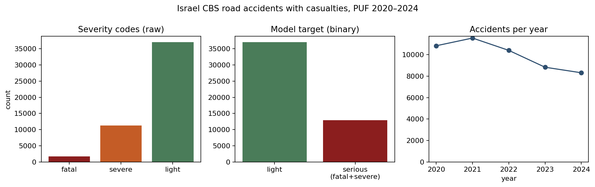
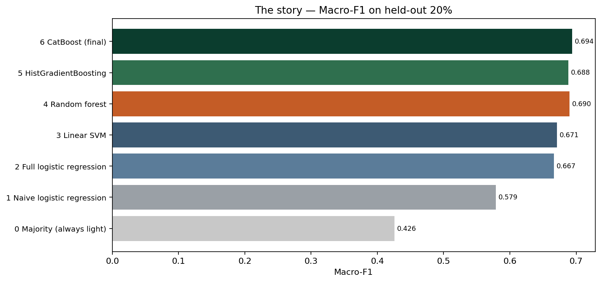
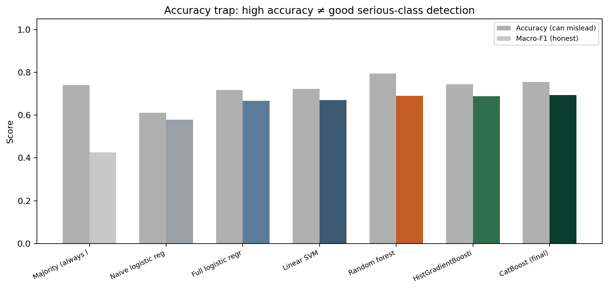
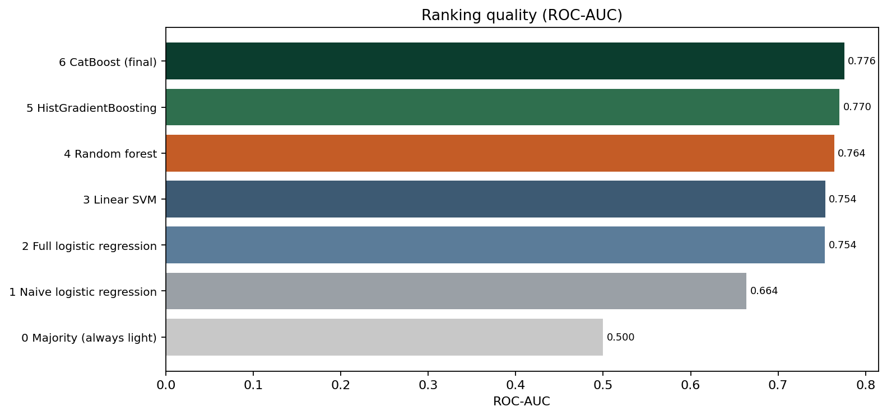

# Israel Road Accident Severity Classifier

Supervised learning on official Israeli government microdata: given the scene of a road accident (road type, time, district, weather, lighting, accident type, coordinates, …), predict whether the outcome is **serious** (fatal or severe injury) or **light**.

This is a tabular, imbalanced classification problem built for the **Theoretical Foundations of Data Science** Python project (Ariel University, Dr. Elad Aigner-Horev). Course expectations: own real dataset, visualization, stated preconceptions, several models, GitHub delivery with a clear written account of what was done.

---

## Motivation

Road-casualty data in Israel is published yearly by the Central Bureau of Statistics (CBS / למ״ס) as a Public Use File. Severity is coded on every accident record, which makes a natural prediction question: **how much of the severity signal is already visible in the scene**, before (or without) using outcome-side details that would leak the answer?

That framing matters for two reasons:

- **Metric honesty.** About three quarters of accidents are light. A model that always predicts “light” gets ~74% accuracy and is useless for public safety. We therefore rank models by macro-F1, balanced accuracy, ROC-AUC, and F1 on the serious class.
- **Model story.** We deliberately start from a naive guess (a few obvious features + logistic regression), move through full linear models, show how raw accuracy can flatter a random forest, then finish with gradient-boosted trees that handle high-cardinality categoricals properly. **CatBoost** is the final model.

---

## Dataset

| Field | Detail |
|-------|--------|
| Source page | https://data.gov.il/he/datasets/lamas/2023-puf |
| Package UUID | `02789da8-7a3e-4bfc-b771-1732b1cf403c` |
| Publisher | Israel Central Bureau of Statistics (CBS), based on Israel Police reports |
| Coverage | 2020–2024, **49,941** accidents with casualties |
| File in this repo | `data/accidents_2020_2024.csv` |

Related overview page: https://govil.ai/datasets/02789da8-7a3e-4bfc-b771-1732b1cf403c/

**Target.** CBS field `HUMRAT_TEUNA`:

| Code | Meaning | Our label |
|------|---------|-----------|
| 1 | Fatal | serious |
| 2 | Severe | serious |
| 3 | Light | light |

Counts in the combined file: serious **12,937** (25.9%), light **37,004** (74.1%).  
Train / test: **39,952** / **9,989**, stratified, `random_state=42`.

**How the CSV was built.** Direct CSV download from data.gov.il is blocked by a web application firewall. `src/download_data.py` pulls each yearly table through the CKAN `datastore_search` API and concatenates them. Re-run:

```bash
python src/download_data.py
```

---

## Preconceptions (before fitting)

1. Night-time, non-urban roads, and pedestrian / head-on collision types should raise the chance of a serious outcome.  
2. A small hand-picked feature set (hour, road type, district) should already beat chance — we test that as Act 1 and it does **not** get close to the final model.  
3. Linear models with one-hot encodings will struggle once locality codes and interactions matter.  
4. High accuracy is not the goal; catching the serious minority class is.

---

## Cleaning and features

- Drop rows missing `HUMRAT_TEUNA`.  
- Map severity codes `{1,2} → serious`, `{3} → light`.  
- Categorical missing values → `__MISSING__`; numeric missing → median impute.  
- Features used for the full models include road type, geographic district / locality, hour, day/night, weekday, month, accident type, lane / speed / lighting / weather / surface codes, settlement type, police unit, year, and coordinates `X`,`Y`.  
- Linear models: one-hot encoding (+ scaled numerics).  
- Random forest / HistGradientBoosting: ordinal encoding.  
- CatBoost: native categorical columns.  
- Class imbalance: balanced class weights (CatBoost: `auto_class_weights='Balanced'`).

---

## Layout

```
.
├── README.md                 <- this document
├── requirements.txt
├── data/
│   └── accidents_2020_2024.csv
├── src/
│   ├── download_data.py      <- CKAN download + yearly merge
│   ├── train_models.py       <- staged training (7 models)
│   └── plot_results.py       <- EDA + comparison figures
├── results/
│   ├── fig0_eda.png … fig4_serious_f1.png
│   ├── model_comparison.csv
│   └── meta.json
└── model_files/              <- one saved file per trained model
    ├── majority_baseline.joblib
    ├── naive_logreg.joblib
    ├── logistic_regression.joblib
    ├── linear_svm.joblib
    ├── random_forest.joblib
    ├── hist_gradient_boosting.joblib
    ├── catboost.cbm
    └── best_model.cbm
```

There is a single project README (this file). Nested “pointer” READMEs were removed on purpose.

---

## Run

```bash
pip install -r requirements.txt

python src/download_data.py    # only if data/accidents_2020_2024.csv is missing
python src/train_models.py     # writes results/ + model_files/
python src/plot_results.py     # writes figures under results/
```

---

## Models and held-out results

Seven models, trained in a fixed order that tells the analysis story:

| Step | Model | Accuracy | Balanced acc | Macro-F1 | F1 (serious) | ROC-AUC |
|-----:|-------|---------:|-------------:|---------:|-------------:|--------:|
| 0 | Majority (always light) | 0.741 | 0.500 | 0.426 | 0.000 | 0.500 |
| 1 | Naive logistic regression (few features) | 0.611 | 0.623 | 0.579 | 0.463 | 0.664 |
| 2 | Full logistic regression | 0.717 | 0.690 | 0.667 | 0.537 | 0.754 |
| 3 | Linear SVM | 0.723 | 0.693 | 0.671 | 0.541 | 0.754 |
| 4 | Random forest | **0.795** | 0.670 | 0.690 | 0.510 | 0.764 |
| 5 | HistGradientBoosting | 0.745 | **0.703** | 0.688 | 0.555 | 0.770 |
| 6 | **CatBoost (final)** | 0.756 | 0.703 | **0.694** | **0.557** | **0.776** |

**What to notice**

- Majority baseline: high-looking accuracy, zero serious detection.  
- Naive logistic regression: confirms that “hour + road + district” alone is too weak.  
- Full linear models improve, then plateau.  
- Random forest leads on accuracy but lags the boosters on serious-class F1 and AUC.  
- **CatBoost** wins on macro-F1 and ROC-AUC. Linear SVM is not the best model.

Numbers are also in `results/model_comparison.csv`.

---

## Figures










---

## AI usage disclosure

Development used an LLM coding assistant (Cursor) for locating the CBS API endpoints, drafting training/plotting scripts, repository cleanup, and README wording.


---

## Data attribution

Accident records: Israel CBS Public Use File via [data.gov.il — 2023-puf](https://data.gov.il/he/datasets/lamas/2023-puf). Redistribution must follow the portal’s terms of use.
