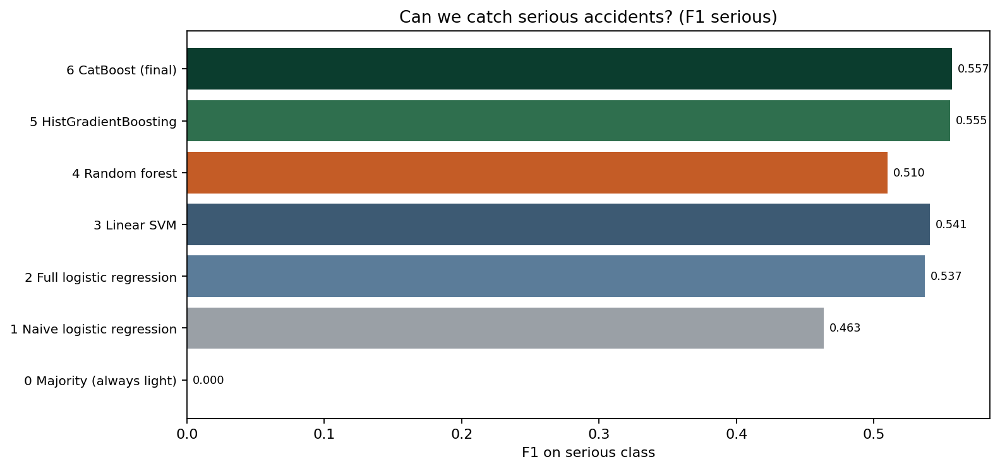

# Road Accident Severity Prediction (Israel CBS)

**Course:** Theoretical Foundations of Data Science · Ariel University  

**Task:** Predict whether a police-reported road accident is **serious** (fatal or severe injury) or **light**, using scene, road, time, and location features from the official CBS Public Use File.

---

## One-paragraph summary

We downloaded and merged **49,941** real Israeli road accidents with casualties (**2020–2024**) from the CBS Public Use File on data.gov.il. After cleaning, we walk through a staged modeling comparison: a majority dummy that “wins” on accuracy while catching zero serious crashes → a naive linear model on a few obvious features → full linear models → a random forest that looks strong on accuracy but weak on the serious class → HistGradientBoosting → **CatBoost** as the final model. CatBoost wins on macro-F1 (**0.694**) and ROC-AUC (**0.776**). Linear SVM is not the best model.

---

## Modeling story

| Act | Model | Point |
|-----|--------|--------|
| 0 | **Majority baseline** (always light) | Accuracy ≈ **0.74** looks fine — serious F1 = **0**. Accuracy alone is misleading. |
| 1 | **Naive logistic regression** (road type + hour + night + weekday + district) | First guess with a small feature set. Macro-F1 **0.579**, AUC **0.664**. |
| 2–3 | **Full logistic regression / linear SVM** | All scene features help (macro-F1 ≈ **0.67**, AUC ≈ **0.75**), but linear models still miss interactions. |
| 4 | **Random forest** | Highest accuracy (**0.795**). Serious-class F1 (**0.510**) still trails the boosted models. |
| 5 | **HistGradientBoosting** | Strong sklearn tree baseline: macro-F1 **0.688**, AUC **0.770**. |
| 6 | **CatBoost (final)** | Native categorical handling. **Best model:** macro-F1 **0.694**, AUC **0.776**. |

---

## Data

| | |
|---|---|
| **Official dataset page** | https://data.gov.il/he/datasets/lamas/2023-puf |
| **Package UUID** | `02789da8-7a3e-4bfc-b771-1732b1cf403c` |
| **Publisher** | Israel Central Bureau of Statistics (CBS), from Israel Police reports |
| **Rows** | 49,941 accidents, years 2020–2024 |
| **Local file** | `data/accidents_2020_2024.csv` |

Related overview: https://govil.ai/datasets/02789da8-7a3e-4bfc-b771-1732b1cf403c/

---

## Target

CBS field `HUMRAT_TEUNA`: **1** fatal, **2** severe, **3** light → **serious = {1,2}** vs **light = {3}**.

| Class | Count | Share |
|-------|------:|------:|
| Serious (fatal + severe) | 12,937 | 25.9% |
| Light | 37,004 | 74.1% |

Holdout: **39,952** train / **9,989** test (stratified, seed 42).

---

## Pipeline

1. Download yearly PUF tables via the data.gov.il CKAN `datastore_search` API; merge into one CSV.  
2. Drop missing severity; map to binary serious/light.  
3. Features = road type, district/locality, hour/day/month, accident type, lighting, weather, surface, speed codes, coordinates, year, and related scene fields.  
4. Missing categoricals → `__MISSING__`; numeric → median impute.  
5. Encoding: one-hot (linear), ordinal (RF / HistGB), native categoricals (CatBoost).  
6. Class imbalance handled with balanced class weights.  
7. Metrics: accuracy, balanced accuracy, macro-F1, F1(serious), ROC-AUC.

---

## Results (held-out 20%)

| Act | Model | Accuracy | Balanced acc | Macro-F1 | F1 (serious) | ROC-AUC |
|----:|-------|---------:|-------------:|---------:|-------------:|--------:|
| 0 | Majority (always light) | 0.741 | 0.500 | 0.426 | 0.000 | 0.500 |
| 1 | Naive logistic regression | 0.611 | 0.623 | 0.579 | 0.463 | 0.664 |
| 2 | Full logistic regression | 0.717 | 0.690 | 0.667 | 0.537 | 0.754 |
| 3 | Linear SVM | 0.723 | 0.693 | 0.671 | 0.541 | 0.754 |
| 4 | Random forest | **0.795** | 0.670 | 0.690 | 0.510 | 0.764 |
| 5 | HistGradientBoosting | 0.745 | **0.703** | 0.688 | 0.555 | 0.770 |
| 6 | **CatBoost (final)** | 0.756 | 0.703 | **0.694** | **0.557** | **0.776** |

A constant “always light” rule already reaches ~74% accuracy, so ranking uses **macro-F1 / balanced accuracy / AUC / serious F1**.

---

## Saved models (`pickles/`)

Each trained model is stored as its own file:

| File | Model |
|------|--------|
| `majority_baseline.joblib` | Majority baseline |
| `naive_logreg.joblib` | Naive logistic regression |
| `logistic_regression.joblib` | Full logistic regression |
| `linear_svm.joblib` | Linear SVM |
| `random_forest.joblib` | Random forest |
| `hist_gradient_boosting.joblib` | HistGradientBoosting |
| `catboost.cbm` | CatBoost (final) |
| `best_model.cbm` | Copy of the best model (CatBoost) |

---

## Figures

### Exploratory data analysis


### Macro-F1 by model


### Accuracy vs macro-F1


### ROC-AUC


### Serious-class F1



---

## Repository layout

```
road_accident_severity/
  data/accidents_2020_2024.csv
  src/download_data.py
  src/train_models.py
  src/plot_results.py
  results/
  pickles/                 # one file per model
  requirements.txt
  README.md
```

---

## Reproduce

```bash
cd road_accident_severity
pip install -r requirements.txt
python src/download_data.py    # if CSV missing
python src/train_models.py
python src/plot_results.py
```

---

## AI / LLM usage (disclosure)

This project was developed **with assistance from an LLM coding assistant (Cursor)**. The assistant helped locate the CBS PUF API, write training and plotting scripts, structure the repository, and draft this README.

**Not fabricated:** the dataset is real government open data; all metrics and figures were produced by running `train_models.py` / `plot_results.py` with scikit-learn and CatBoost. Modeling choices and interpretation were reviewed by the student author.

---

## Attribution

Accident microdata: Israel CBS Public Use File via [data.gov.il — 2023-puf](https://data.gov.il/he/datasets/lamas/2023-puf). Follow the portal’s terms of use when redistributing.
